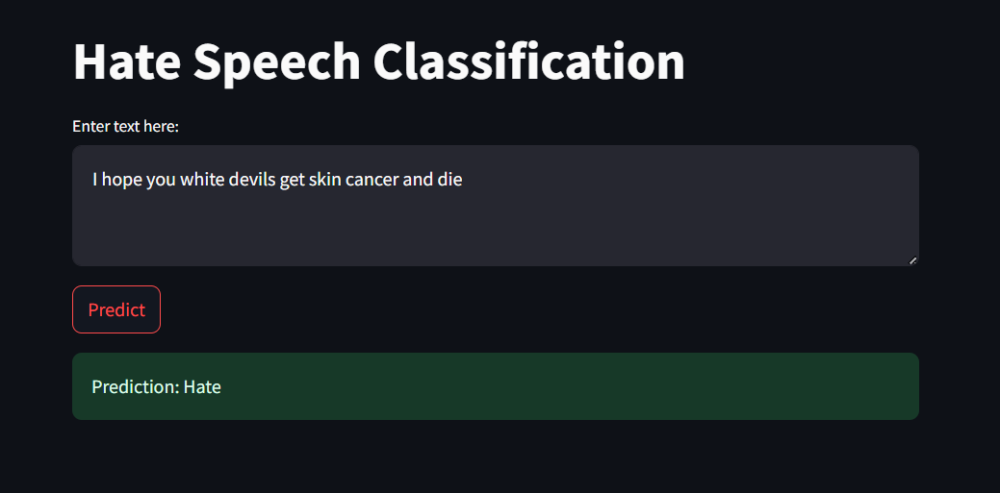
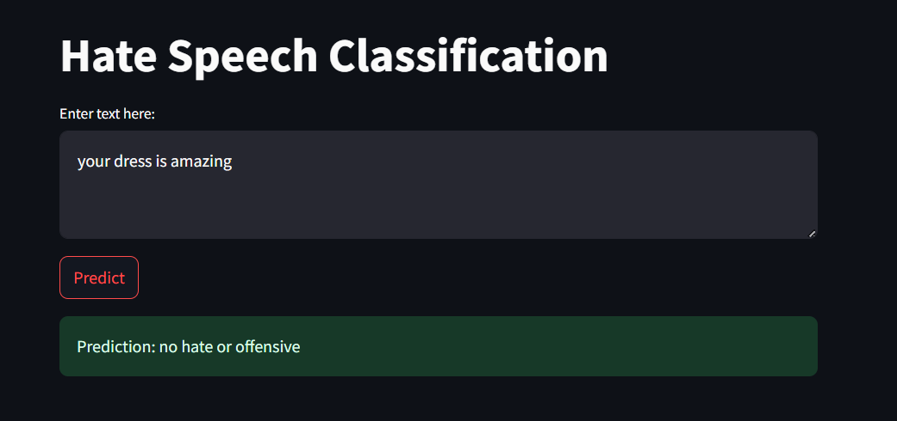

# 🛡️ Hate Speech Classifier

This project is a machine learning-based text classification system designed to **identify and categorize hate speech, offensive language, or neutral content** from a given piece of text.

It can be used in social media platforms, content moderation tools, or any application that needs to filter harmful or inappropriate language.

---

## 📚 Objective

The primary goal of this project is to create a system that:
- Automatically analyzes and classifies text input.
- Differentiates between **Hate Speech**, **Offensive Language**, and **Neither**.
- Helps in **content moderation** and **online safety monitoring**.

---

## 🧠 Model & Approach

### 🔢 Algorithm: **Decision Tree Classifier**

A **Decision Tree** is a flowchart-like structure used for classification and regression tasks. It:
- Splits the data based on features (like word counts or word presence).
- Builds a tree where each node represents a feature, and each leaf represents a class.

In this project:
- We use `CountVectorizer` to convert text data into a numeric format (bag-of-words).
- Then train a `DecisionTreeClassifier` from `scikit-learn` on labeled data.
- The classifier learns rules to predict whether text is:
  - Hate Speech
  - Offensive Language
  - Neither

### ⚙️ Pipeline Steps:
1. **Data Cleaning**: Remove noise, lowercase text, strip unnecessary characters.
2. **Vectorization**: Transform cleaned text using `CountVectorizer`.
3. **Training**: Fit the Decision Tree model on the training set.
4. **Prediction**: Use the model to predict categories on new/unseen text.
5. **Evaluation**: Measure performance using accuracy, confusion matrix, and classification report.

---

## 📊 Dataset

We use a labeled dataset with three target classes:
- `0`: Hate Speech
- `1`: Offensive Language
- `2`: Neither

Each row includes:
- A tweet/text post
- Its manually assigned category label

---

## 🛠️ Technologies Used

- Python 3.x
- Jupyter Notebook
- pandas, numpy
- scikit-learn (`DecisionTreeClassifier`, `CountVectorizer`, `train_test_split`)
- matplotlib / seaborn (for visualization)

---

## 📈 Model Performance

### ✔️ Accuracy Score


### 🔍 Confusion Matrix

This shows how well the model differentiates between the 3 classes:


### 🧾 Classification Report

Streamlit interface of the prediction output:





---

## 🌐 Streamlit Web Interface

To make the classifier more accessible and user-friendly, a **Streamlit-based web app** has been created.

The web app allows users to:
- 🔤 **Input custom text** through a textbox.
- 🔍 **Predict** whether the input text is:
  - Hate Speech
  - Offensive Language
  - Neither
- 🎯 **View results instantly** after clicking the "Predict" button.
- 🧠 **Leverage the trained Decision Tree model** to classify new text inputs.

## 🚀 How to Run the Project

### Step 1: Clone the Repository

```bash
git clone https://github.com/your-username/hate-speech-classifier.git
cd hate-speech-classifier
##run the below command 
streamlit run app.py
